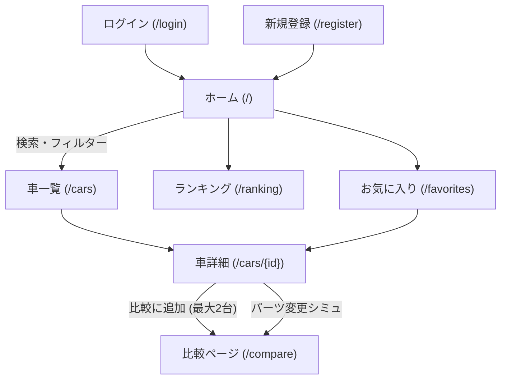
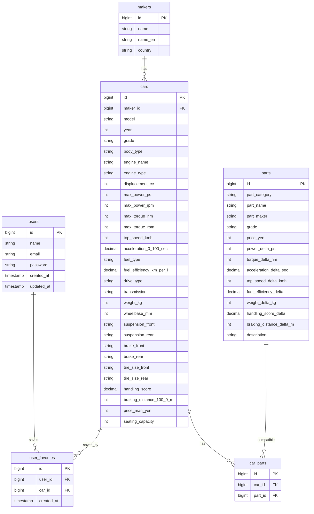

# 車性能比較アプリ 要件定義

## 技術スタック

- Backend: Laravel (PHP)
- Frontend: Vue.js (Inertia.js でサーバーサイドルーティングと統合)
- DB: PostgreSQL 16
- インフラ: Docker (既存の docker-compose.yml)

Inertia.js を使うことで、Laravel Blade のルーティング管理を保ちつつ Vue.js でリッチなUI を構築できる（フルSPAより簡易）。

---

## 機能要件

- ユーザー認証（登録・ログイン・ログアウト）
- 車一覧・検索・フィルター（メーカー / 年式 / 駆動方式 / 価格帯 / 燃料種別）
- 車詳細スペック表示
- 2台同時比較（メーカー跨ぎ可）
- パーツ交換シミュレーション（パーツ変更 → 性能数値がリアルタイム更新）
- パーツ変更後の車同士も比較可能
- 性能項目別ランキング（最高速 / 加速 / ハンドリング など）
- お気に入り登録（要ログイン）

---

## 画面構成

### 各画面の主要コンテンツ

- **ホーム**: 検索バー・フィルター・ランキングプレビュー（TOP5）・最近追加された車
- **車一覧**: カード形式グリッド・絞り込みサイドバー・「比較に追加」ボタン
- **車詳細**: 全スペック表・パーツカテゴリ別プルダウン（変更するとリアルタイムで数値更新）・レーダーチャート・「比較に追加」ボタン
- **比較ページ**: 2台をサイドバイサイドで並べた表・レーダーチャート重ね合わせ・優劣をハイライト
- **ランキング**: 項目タブ切り替え（最高速 / 0-100加速 / ハンドリング / トルク / 燃費）・上位10台
- **お気に入り**: 登録した車のカード一覧

---

## DB設計

### テーブル補足

- `car_parts`: CSVの `compatible_models` を正規化した中間テーブル（多対多）
- パーツシミュレーションのロジック: `cars` の基本値 + 選択した `parts` の delta値 をフロントで計算
- 保存済みビルド機能（カスタム構成の保存）はフェーズ2として将来拡張可

---

## 実装フェーズ（推奨順）

1. DB マイグレーション・シーダー（CSV からインポート）
2. Laravel 認証（Laravel Breeze + Inertia + Vue）
3. 車一覧・詳細 API + 画面
4. 比較機能
5. パーツシミュレーション
6. ランキング・お気に入り
