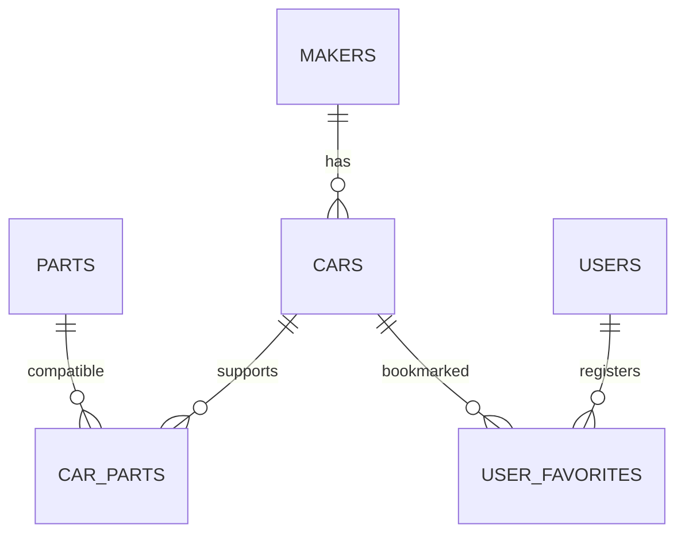

# 車性能比較アプリ「CarComp」仕様書

## 1. 文書情報

| 項目 | 内容 |
|---|---|
| 文書名 | 車性能比較アプリ「CarComp」仕様書 |
| 対象 | `mybuild` Laravelアプリケーション |
| 版 | 0.1 |
| ステータス | ドラフト |
| 作成日 | 2026-08-06 |
| 根拠 | 現在のソースコード、DBマイグレーション、CSV、`PLAN.md` |

本書は、現時点のコードから確認できる事実と、`PLAN.md` に記載された完成予定の仕様を整理したものである。各項目は次の状態で区別する。

- **実装済み**: 現在のソースコードに存在する
- **実装予定**: `PLAN.md` に記載されているが、現在のソースコードには存在しない
- **要決定**: 実装前に仕様の確定が必要

## 2. システム概要

### 2.1 目的

車種ごとの性能を検索・閲覧・可視化し、パーツ交換後の性能シミュレーションや2台比較を行えるWebアプリケーションを提供する。

### 2.2 想定利用者

| 利用者 | 利用内容 |
|---|---|
| ゲスト | 車両検索、一覧・詳細閲覧、ランキング閲覧、パーツ交換シミュレーション、車両比較 |
| 登録ユーザー | ゲストの機能に加え、車両のお気に入り登録・解除・一覧閲覧 |
| 運用者 | CSVとシーダーによるメーカー・車両・パーツ・適合情報の投入 |

管理画面およびWeb画面からのマスターデータ編集は、現時点では対象外とする。

### 2.3 対象範囲

- メーカー・車両・パーツ情報の表示
- 車両の絞り込み
- 車両性能のチャート表示
- 適合パーツを用いた性能変化の試算
- 2台の車両比較
- 性能項目別ランキング
- ユーザー認証
- お気に入り管理

### 2.4 初期データ範囲

- メーカーマスター: 10社（トヨタ、ホンダ、日産、マツダ、スバル、BMW、メルセデス・ベンツ、ポルシェ、フェラーリ、ランボルギーニ）
- 車両データ: トヨタ車15台
- パーツデータ: トヨタ車向け79件
- 車両とパーツの適合関係: CSVの `compatible_models` を基に登録

車両・パーツの初期データはトヨタのみであり、他メーカーはメーカーマスターだけを保持する。

## 3. 機能要件

### 3.1 機能一覧

| ID | 機能 | 概要 | 認証 | 状態 |
|---|---|---|---|---|
| F-01 | ホーム | 検索欄とランキング上位5台を表示する | 不要 | 実装予定 |
| F-02 | 車両一覧 | 車両を12件単位で一覧表示し、条件で絞り込む | 不要 | 実装予定 |
| F-03 | 車両詳細 | 車両諸元、適合パーツ、性能チャートを表示する | 不要 | 実装予定 |
| F-04 | パーツ交換シミュレーション | 適合パーツ選択後の性能値をリアルタイム計算する | 不要 | 実装予定 |
| F-05 | 車両比較 | 選択した2台の諸元とチャートを比較する | 不要 | 実装予定 |
| F-06 | ランキング | 指定した性能項目の上位10台を表示する | 不要 | 実装予定 |
| F-07 | ユーザー登録 | 名前、メールアドレス、パスワードで登録する | 不要 | 実装予定 |
| F-08 | ログイン・ログアウト | セッション認証を開始・終了する | ログアウトのみ必要 | 実装予定 |
| F-09 | お気に入り | 車両を登録・解除し、登録済み車両を一覧表示する | 必要 | 実装予定 |
| F-10 | データ投入 | CSVから車両・パーツ・適合関係を登録する | CLI | 実装済み |

現時点でWebルートに存在するのは、Laravel標準のウェルカム画面を表示する `GET /` のみである。

### 3.2 ホーム（F-01）

- 車両を探すための検索欄を表示する。
- 性能ランキングの上位5台をプレビュー表示する。
- 車両一覧、ランキング、認証画面へ移動できる。
- 検索対象、検索方法、ランキングの初期指標は要決定とする。

### 3.3 車両一覧（F-02）

- 車両をカード形式で1ページ12件表示する。
- 表示順はメーカーID、車名、年式の昇順とする。
- 各カードから車両詳細へ遷移できる。
- 次の条件で絞り込める。

| 条件 | パラメーター | 判定 |
|---|---|---|
| メーカー | `maker` | メーカーIDの完全一致 |
| 駆動方式 | `drive_type` | 完全一致 |
| 燃料種別 | `fuel_type` | 完全一致 |
| 年式（下限） | `year_from` | 指定値以上 |
| 年式（上限） | `year_to` | 指定値以下 |
| 価格（上限） | `price_max` | 指定万円以下 |

クエリーパラメーターの入力検証、許容値、異常値時の挙動は要決定とする。

### 3.4 車両詳細（F-03）

- メーカー、車名、年式、グレードおよび「7.2 車両」に示す全諸元を表示する。
- 車両に適合するパーツをカテゴリー別に表示する。
- 出力、トルク、ハンドリング、最高速度、0-100 km/h加速、燃費をレーダーチャートで表示する。
- レーダーチャートは各単位の実値を共通スケールへ正規化して描画する。

正規化の上限・下限、範囲外の値の扱い、およびチャート上の説明表示は要決定とする。

### 3.5 パーツ交換シミュレーション（F-04）

- 車両に適合するパーツだけを選択候補とする。
- パーツカテゴリーごとに最大1件を選択できる。
- 複数カテゴリーのパーツを同時に選択できる。
- 選択パーツの性能差分をベース車両の値に加算し、結果を即時表示する。
- 元の値との差分を視覚的に強調する。
- パーツ価格の合計表示は要決定とする。
- シミュレーション結果は永続化せず、ブラウザー上の一時状態として扱う。

計算対象は次のとおりとする。

| 車両性能 | 計算に使うパーツ差分 |
|---|---|
| 最高出力（PS） | `power_delta_ps` |
| 最大トルク（Nm） | `torque_delta_nm` |
| 0-100 km/h加速（秒） | `acceleration_delta_sec` |
| 最高速度（km/h） | `top_speed_delta_kmh` |
| 燃費（km/L） | `fuel_efficiency_delta` |
| 車重（kg） | `weight_delta_kg` |
| ハンドリングスコア | `handling_score_delta` |
| 100-0 km/h制動距離（m） | `braking_distance_delta_m` |

単純加算による結果は実車性能を保証するものではない。最低値・最高値の制限や、パーツ同士の相互作用は現仕様に含まれない。

### 3.6 車両比較（F-05）

- 比較候補はクライアント側の比較カートで保持する。
- 同一車両を重複登録できない。
- 比較カートには最大2台を登録できる。
- 比較カートに車両がある場合、全ページ下部にフローティングバーを表示する。
- 「比較する」操作で `GET /compare?ids={id1},{id2}` に遷移する。
- 比較画面では2台の諸元を横並びで表示する。
- 数値項目は優れている値を緑、劣っている値を赤で表示する。
- 2台分の性能を1つのレーダーチャートに重ねて表示する。

比較カートのページ再読み込み後の保持方法、1台だけ指定された場合、不正・重複・存在しないIDが指定された場合の挙動は要決定とする。

### 3.7 ランキング（F-06）

- 選択した項目について上位10台を表示する。
- 0-100 km/h加速は昇順、それ以外は降順で順位を決定する。

| 表示項目 | DB項目 | 並び順 |
|---|---|---|
| 最高速度 | `top_speed_kmh` | 降順 |
| 最高出力 | `max_power_ps` | 降順 |
| 最大トルク | `max_torque_nm` | 降順 |
| ハンドリング | `handling_score` | 降順 |
| 0-100 km/h加速 | `acceleration_0_100_sec` | 昇順 |
| 燃費 | `fuel_efficiency_km_per_l` | 降順 |

同値時の順位規則と二次ソート条件は要決定とする。

### 3.8 認証（F-07、F-08）

#### ユーザー登録

- 入力項目: 名前、メールアドレス、パスワード、パスワード確認
- 名前: 必須、文字列、255文字以内
- メールアドレス: 必須、メール形式、重複不可
- パスワード: 必須、8文字以上、確認入力との一致
- 登録成功後は自動ログインし、ホームへ遷移する。

#### ログイン

- 入力項目: メールアドレス、パスワード、ログイン状態を保持するか
- 認証成功後はセッションIDを再生成し、直前の遷移先またはホームへ移動する。
- 認証失敗時は、メールアドレスまたはパスワードが正しくない旨を表示する。

#### ログアウト

- 認証済みユーザーだけが実行できる。
- セッションを無効化し、CSRFトークンを再生成してホームへ遷移する。

メールアドレス確認、パスワード再設定、アカウント編集・削除は現時点の完成予定機能に含まれない。

### 3.9 お気に入り（F-09）

- 認証済みユーザーは、車両一覧または詳細の星ボタンからお気に入り状態を切り替えられる。
- 登録操作は `POST /favorites/{car}` とし、未登録なら登録、登録済みなら解除する。
- `GET /favorites` でログインユーザーのお気に入り車両を一覧表示する。
- 同一ユーザーが同一車両を重複登録することは禁止する。
- 未認証時はログイン画面へ遷移する。
- Ajax成功・失敗時のレスポンス形式と画面通知は要決定とする。

### 3.10 データ投入（F-10）

- `MakerSeeder` が10メーカーを登録する。
- `CarSeeder` が `toyota_cars.csv` から車両を登録・更新する。
- `PartSeeder` が `toyota_parts.csv` からパーツを登録・更新する。
- `CarPartSeeder` が `compatible_models` の `|` 区切りを展開し、トヨタ車の同名モデルすべてにパーツを関連付ける。
- シーダーはメーカー、車両、パーツ、適合関係の順に実行する。
- CSVに存在しないメーカーやパーツの行はスキップする。

## 4. 画面仕様

| 画面ID | 画面 | URL | 主な要素 | 状態 |
|---|---|---|---|---|
| S-01 | ホーム | `/` | 検索、ランキング上位5台 | 実装予定 |
| S-02 | 車両一覧 | `/cars` | フィルター、車両カード、ページネーション | 実装予定 |
| S-03 | 車両詳細 | `/cars/{car}` | 諸元、レーダーチャート、パーツシミュレーター | 実装予定 |
| S-04 | 車両比較 | `/compare?ids=1,2` | 比較表、比較チャート | 実装予定 |
| S-05 | ランキング | `/ranking` | 指標タブ、上位10台 | 実装予定 |
| S-06 | ログイン | `/login` | ログインフォーム | 実装予定 |
| S-07 | ユーザー登録 | `/register` | 登録フォーム | 実装予定 |
| S-08 | お気に入り | `/favorites` | お気に入り車両一覧 | 実装予定 |

### 4.1 共通レイアウト

- 表示言語は日本語とする。
- ページタイトルは「各画面名 | CarComp」とする。
- ナビゲーションにロゴ、主要ページへのリンク、認証状態に応じたメニューを表示する。
- 全ページでViteビルド済みのCSSとJavaScriptを読み込む。
- 比較候補がある場合は比較バーを表示する。
- デスクトップとモバイルで利用可能なレスポンシブ表示を目標とする。

## 5. URL・インターフェース仕様

| HTTP | URL | 処理 | 認証 | 状態 |
|---|---|---|---|---|
| GET | `/` | ホーム表示 | 不要 | 実装予定 |
| GET | `/cars` | 車両一覧・絞り込み | 不要 | 実装予定 |
| GET | `/cars/{car}` | 車両詳細表示 | 不要 | 実装予定 |
| GET | `/compare` | 車両比較表示 | 不要 | 実装予定 |
| GET | `/ranking` | ランキング表示 | 不要 | 実装予定 |
| GET | `/login` | ログインフォーム表示 | ゲストのみ | 実装予定 |
| POST | `/login` | ログイン | ゲストのみ | 実装予定 |
| GET | `/register` | 登録フォーム表示 | ゲストのみ | 実装予定 |
| POST | `/register` | ユーザー登録 | ゲストのみ | 実装予定 |
| POST | `/logout` | ログアウト | 必要 | 実装予定 |
| GET | `/favorites` | お気に入り一覧 | 必要 | 実装予定 |
| POST | `/favorites/{car}` | お気に入り登録・解除 | 必要 | 実装予定 |

専用の外部公開APIは現時点では設けない。

## 6. ビジネスルール

| ID | ルール |
|---|---|
| BR-01 | 車両は必ず1つのメーカーに属する。 |
| BR-02 | 車両とパーツは多対多で関連付ける。 |
| BR-03 | パーツ交換候補には対象車両に関連付いたパーツだけを表示する。 |
| BR-04 | 1カテゴリーにつき選択できるパーツは1件とする。 |
| BR-05 | 比較対象は重複なしで最大2台とする。 |
| BR-06 | お気に入りは同一ユーザー・同一車両につき1件とする。 |
| BR-07 | メーカーまたは車両の削除時は、その配下・関連データを連鎖削除する。 |
| BR-08 | パーツシミュレーションは参考値であり、実測値を保証しない。 |

## 7. データ仕様

### 7.1 ER概要

すべての主要テーブルは `id`、`created_at`、`updated_at` を持つ。

### 7.2 車両（`cars`）

| 項目 | 型 | 内容・単位 |
|---|---|---|
| `maker_id` | FK | メーカーID |
| `model` | string | 車名 |
| `year` | smallint | 年式 |
| `grade` | string | グレード |
| `body_type` | string | ボディタイプ |
| `engine_name` | string | エンジン名称・型式 |
| `engine_type` | string | エンジン種別 |
| `displacement_cc` | integer | 排気量（cc） |
| `max_power_ps` | integer | 最高出力（PS） |
| `max_power_rpm` | integer | 最高出力回転数（rpm） |
| `max_torque_nm` | integer | 最大トルク（Nm） |
| `max_torque_rpm` | integer | 最大トルク回転数（rpm） |
| `top_speed_kmh` | integer | 最高速度（km/h） |
| `acceleration_0_100_sec` | decimal(4,1) | 0-100 km/h加速（秒） |
| `fuel_type` | string | 燃料種別 |
| `fuel_efficiency_km_per_l` | decimal(4,1) | 燃費（km/L） |
| `drive_type` | string | 駆動方式 |
| `transmission` | string | 変速機 |
| `weight_kg` | integer | 車重（kg） |
| `wheelbase_mm` | integer | ホイールベース（mm） |
| `suspension_front` | string | フロントサスペンション |
| `suspension_rear` | string | リアサスペンション |
| `brake_front` | string | フロントブレーキ |
| `brake_rear` | string | リアブレーキ |
| `tire_size_front` | string | フロントタイヤサイズ |
| `tire_size_rear` | string | リアタイヤサイズ |
| `handling_score` | decimal(3,1) | ハンドリング評価 |
| `braking_distance_100_0_m` | integer | 100-0 km/h制動距離（m） |
| `price_man_yen` | integer | 車両価格（万円） |
| `seating_capacity` | smallint | 乗車定員 |

### 7.3 パーツ（`parts`）

| 項目 | 型 | 内容・単位 |
|---|---|---|
| `part_category` | string | カテゴリー |
| `part_name` | string | パーツ名 |
| `part_maker` | string | パーツメーカー |
| `grade` | string | グレード |
| `price_yen` | integer | 価格（円） |
| `power_delta_ps` | integer | 最高出力差分（PS） |
| `torque_delta_nm` | integer | 最大トルク差分（Nm） |
| `acceleration_delta_sec` | decimal(4,2) | 0-100 km/h加速差分（秒） |
| `top_speed_delta_kmh` | integer | 最高速度差分（km/h） |
| `fuel_efficiency_delta` | decimal(4,1) | 燃費差分（km/L） |
| `weight_delta_kg` | integer | 車重差分（kg） |
| `handling_score_delta` | decimal(3,1) | ハンドリング差分 |
| `braking_distance_delta_m` | integer | 制動距離差分（m） |
| `description` | text/null | 説明 |

初期CSVで使用するカテゴリーは `ecu_tune`、`exhaust`、`suspension`、`brake`、`tire`、`air_filter`、`intercooler` である。

### 7.4 その他の主要テーブル

| テーブル | 主な項目 | 制約 |
|---|---|---|
| `makers` | `name`, `name_en`, `country` | `name_en` は一意 |
| `car_parts` | `car_id`, `part_id` | 組み合わせは一意、削除連鎖 |
| `users` | `name`, `email`, `password`, `email_verified_at`, `remember_token` | `email` は一意 |
| `user_favorites` | `user_id`, `car_id` | 組み合わせは一意、削除連鎖 |
| `sessions` | セッション情報 | DBセッション用 |

## 8. 技術・構成仕様

### 8.1 アプリケーション

| 分類 | 採用技術 |
|---|---|
| バックエンド | PHP 8.4、Laravel 12 |
| DB | PostgreSQL 16 |
| サーバーサイド画面 | Blade |
| インタラクティブUI | Vue 3 |
| 状態管理 | Pinia |
| スタイル | Tailwind CSS 4 |
| チャート | Chart.js、vue-chartjs |
| ビルド | Vite 7、Node.js 20.20.2 |
| Webサーバー | Apache |
| 開発環境 | Docker Compose |
| DB管理 | pgAdmin 4 |

`inertiajs/inertia-laravel` はインストール済みだが、本アプリでは使用しない方針であり、削除候補とする。

### 8.2 コンテナーとローカルアクセス

| サービス | コンテナー | URL・接続先 |
|---|---|---|
| アプリ | `mybuild_app` | `http://localhost:8080` |
| PostgreSQL | `mybuild_db` | `localhost:5432`、DB/ユーザー/パスワード: `mybuild` |
| pgAdmin | `mybuild_pgadmin` | `http://localhost:5050` |

上記認証情報はローカル開発専用とし、本番環境では環境変数またはシークレット管理へ移す。

## 9. 非機能要件

### 9.1 セキュリティ

- パスワードはLaravelのハッシュキャストまたは `Hash` を使用して保存する。
- ログイン成功時にセッションIDを再生成する。
- ログアウト時にセッションを無効化し、CSRFトークンを再生成する。
- 状態変更リクエストはCSRF保護対象とする。
- 認証が必要なルートには `auth` ミドルウェアを適用する。
- DB検索のランキング項目は許可リストで制限し、任意の列名を使用させない。
- 本番環境では `APP_DEBUG=false` とし、DB・pgAdminを外部公開しない。

### 9.2 ユーザビリティ・アクセシビリティ

- レイアウトは主要なスマートフォン・デスクトップ幅で破綻しないこと。
- フォーム項目にはラベルと具体的なエラーメッセージを表示すること。
- 色だけで優劣や状態を伝えず、記号またはテキストも併用すること。
- キーボードで主要操作を実行できること。

### 9.3 性能・運用

- 車両一覧は12件単位でページネーションする。
- 一覧・ランキング・比較ではメーカーをEager Loadingし、N+1クエリーを避ける。
- アプリケーションログはLaravelのログ機構へ記録する。
- マイグレーションとシーダーで開発DBを再構築できること。
- 具体的な応答時間、同時利用者数、可用性、バックアップ、監視基準は要決定とする。

## 10. 受け入れ条件

| ID | 条件 |
|---|---|
| AC-01 | フロントエンドの本番ビルドがエラーなく完了する。 |
| AC-02 | ユーザー登録、ログイン、ログアウトが仕様どおり動作する。 |
| AC-03 | 車両一覧で全フィルターとページネーションが動作する。 |
| AC-04 | 車両詳細に全諸元と適合パーツが表示される。 |
| AC-05 | パーツの選択・解除に応じて対象性能が正しく再計算される。 |
| AC-06 | 重複なしで最大2台を比較対象に追加できる。 |
| AC-07 | 2台比較で数値の優劣とレーダーチャートが正しく表示される。 |
| AC-08 | 各ランキング指標が正しい向きで並び、上位10台を表示する。 |
| AC-09 | 認証済みユーザーがお気に入りを登録・解除・一覧表示できる。 |
| AC-10 | 未認証ユーザーがお気に入り操作を行うとログイン画面へ遷移する。 |
| AC-11 | DBを再作成してシードすると、想定件数のデータと適合関係が登録される。 |
| AC-12 | 自動テストで主要な正常系、入力エラー、認可、境界値を検証できる。 |

## 11. 現在の実装状況

### 11.1 実装済み

- Docker Composeによるアプリ、PostgreSQL、pgAdminの構成
- Laravel 12の基本プロジェクト
- Vue、Pinia、Chart.js、Tailwind CSS、Viteの依存関係とViteプラグイン設定
- メーカー、車両、パーツ、車両パーツ、お気に入りのDBマイグレーション
- Maker、Car、Part、UserFavoriteのEloquentモデルと関連
- CSVを読む各シーダー
- トヨタ車およびパーツのCSV

### 11.2 未実装

- 共通レイアウトと全業務画面
- 認証コントローラーと認証ルート
- 車両一覧・詳細、比較、ランキング、お気に入りの各コントローラーとルート
- VueコンポーネントとPiniaストア
- 業務機能の自動テスト

## 12. 現状の既知課題

1. **CSV配置の不一致**  
   シーダーは `mybuild/storage/app/car_data/*.csv` を参照するが、CSVはリポジトリ直下の `car_data/` にある。さらにアプリコンテナーには `mybuild/` だけがマウントされるため、現構成のまま新規環境でシードしてもCSVを読み込めない。

2. **DB初期設定の不一致**  
   `.env.example` はSQLiteを指定している一方、Docker ComposeはPostgreSQLを提供する。Docker利用時に必要なPostgreSQL設定を明文化または環境ファイルへ反映する必要がある。

3. **データ投入完了の再現性**  
   `PLAN.md` は「DB投入済み」としているが、DBボリュームの内容はGit管理されない。新規環境ではシーダーを正常に再実行できることを完了条件とする必要がある。

4. **ユーザー関連のモデル定義**  
   `UserFavorite` からUserへの関連はあるが、Userからお気に入りへの逆向きの関連は未定義である。

5. **性能値の定義**  
   ハンドリングスコアの算出根拠、レーダーチャートの正規化、シミュレーション結果の上下限が未定義である。

6. **比較状態の保持**  
   Piniaのみではページ遷移や再読み込みで比較候補が失われる可能性がある。URL、Web Storage、またはサーバーセッションのどれを正とするか決定が必要である。

## 13. 要決定事項

実装開始前に、少なくとも次の項目を確定する。

1. ホーム検索の対象項目と検索結果への遷移方法
2. ホームで表示するランキング指標
3. フィルター・比較ID・ランキング指標の入力エラー時の挙動
4. レーダーチャート正規化式と上下限
5. シミュレーション値の許容範囲、価格合計表示、免責表示
6. 比較候補の永続化方法と1台のみの場合の扱い
7. 数値比較で「小さい方が良い」項目の全一覧
8. ランキング同値時の順位規則
9. お気に入りAjaxのレスポンス形式とエラー表示
10. 車両画像の有無、入手元、著作権上の扱い
11. 性能データの出典、更新方針、正確性に関する表示
12. 本番環境、公開範囲、性能・可用性・バックアップ・監視目標

