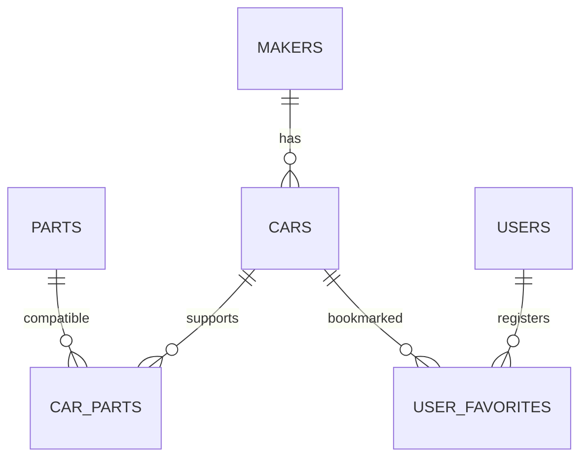

# 車性能比較アプリ「MyBuild」仕様書

## 1. 文書情報

| 項目 | 内容 |
|---|---|
| 文書名 | 車性能比較アプリ「MyBuild」仕様書 |
| 対象 | `MyBuild` Laravelアプリケーション |
| 版 | 0.2 |
| ステータス | ドラフト |
| 作成日 | 2026-08-14 |
| 前版からの変更 | ペルソナ定義、データ方針（ダミーデータ先行）、画面設計を追加・改訂 |

---

## 2. ペルソナ

| # | ペルソナ名 | 属性 | 利用シーン |
|---|---|---|---|
| P-1 | カーオタク | 全年代・知識豊富 | スペックの細かい数値まで確認し、2台を徹底比較する |
| P-2 | チューナー | 全年代・知識豊富 | パーツ交換後の性能変化をシミュレーションして楽しむ（Phase 2） |
| P-3 | 購入検討者 | 全年代・知識中程度 | 候補2〜3台を比べて購入の参考にする |
| P-4 | ライト層 | 全年代・知識浅め | ランキングや一覧を眺めて車を楽しむ |

**共通特性**
- 端末：PC・スマートフォン両対応（レスポンシブ必須）
- 知識レベル：初心者〜マニアまで混在するため、専門用語には補足説明を添える

---

## 3. システム概要

### 3.1 目的

車種ごとの性能を検索・閲覧・可視化し、2台を横並びで比較できるWebアプリケーションを提供する。

### 3.2 想定利用者

| 利用者 | 利用内容 |
|---|---|
| ゲスト | 車両検索・一覧・詳細閲覧、ランキング閲覧、2台比較 |
| 登録ユーザー | ゲストの機能に加え、お気に入り登録・解除・一覧閲覧 |
| 管理者 | 管理画面からメーカー・車両・パーツ・ユーザーのCRUD、CSVインポート |

### 3.3 商用利用方針

このアプリは商用目的での公開を予定している。以下の方針に従いデータを管理する。

| 項目 | 開発フェーズ | 本番フェーズ（権利確認後） |
|---|---|---|
| メーカー名 | ダミー（例：Tokai Motors） | 各社への問い合わせ・許諾取得後に差し替え |
| 車名・型式 | ダミー | 許諾取得後に差し替え |
| 性能スペック | ダミー数値 | カタログ値に差し替え |
| 車両画像 | なし（プレースホルダーのみ） | 許諾取得後または自前素材 |

**必須の法的対応**
- アプリ内に「本サービスは各自動車メーカーとは無関係です」旨の非提携表示を掲載
- 車両詳細ページに「掲載データは参考値であり、実測値を保証しません」旨の免責表示を掲載
- 公式ロゴ・画像の無断使用禁止

---

## 4. 機能要件

### 4.1 フェーズ区分

| フェーズ | 機能 | 優先度 |
|---|---|---|
| **Phase 1** | ユーザー認証（登録・ログイン・ログアウト） | 必須 |
| **Phase 1** | 車両一覧・検索・絞り込み | 必須 |
| **Phase 1** | 車両詳細（スペック表・レーダーチャート） | 必須 |
| **Phase 1** | **2台比較**（横並び・優劣ハイライト・レーダー重ね表示） | 必須・コア |
| **Phase 1** | 性能ランキング（6指標・上位10台） | 必須 |
| **Phase 1** | お気に入り登録・解除・一覧 | 必須 |
| **Phase 1** | 管理者画面（メーカー・車両・パーツ・ユーザー・CSVインポート） | 必須 |
| **Phase 2** | パーツ交換シミュレーション | 後回し |
| **Nice** | 比較結果・カスタム構成のSNSシェア | 余裕があれば |

### 4.2 機能一覧

| ID | 機能 | 概要 | 認証 | フェーズ |
|---|---|---|---|---|
| F-01 | ホーム | 検索バーとカテゴリーボタンを表示する | 不要 | Phase 1 |
| F-02 | 車両一覧 | 車両を12件単位で一覧表示し、条件で絞り込む | 不要 | Phase 1 |
| F-03 | 車両詳細 | 車両諸元・レーダーチャートを2カラムで表示する | 不要 | Phase 1 |
| F-04 | 車両比較 | 選択した2台の諸元とレーダーチャートを比較する | 不要 | Phase 1 |
| F-05 | ランキング | 指定した性能項目の上位10台を横タブで切り替え表示 | 不要 | Phase 1 |
| F-06 | ユーザー登録 | 名前、メールアドレス、パスワードで登録する | 不要 | Phase 1 |
| F-07 | ログイン・ログアウト | セッション認証を開始・終了する | ログアウトのみ必要 | Phase 1 |
| F-08 | お気に入り | 車両を登録・解除し、登録済み車両を一覧表示する | 必要 | Phase 1 |
| F-09 | 管理者画面 | メーカー・車両・パーツ・ユーザーのCRUDとCSVインポート | admin Guard | Phase 1 |
| F-10 | パーツ交換シミュレーション | 適合パーツ選択後の性能値をリアルタイム計算する | 不要 | Phase 2 |
| F-11 | SNSシェア | 比較結果・カスタム構成をSNSでシェアする | 不要 | Nice |

---

## 5. 画面仕様

### 5.1 顧客向け画面一覧

| 画面ID | 画面名 | URL | 主な要素 |
|---|---|---|---|
| S-01 | ホーム | `/` | 検索バー、カテゴリーボタン（ボディタイプ等） |
| S-02 | 車両一覧 | `/cars` | 上部フィルターバー、車両カードグリッド（12件/ページ）、ページネーション |
| S-03 | 車両詳細 | `/cars/{car}` | 2カラム（左：諸元・比較追加ボタン、右：レーダーチャート）、免責表示 |
| S-04 | 車両比較 | `/compare?ids={id1},{id2}` | 横並び比較表（優劣ハイライト）、レーダーチャート重ね表示 |
| S-05 | ランキング | `/ranking` | 横タブ（6指標）、上位10台リスト |
| S-06 | ログイン | `/login` | ログインフォーム |
| S-07 | ユーザー登録 | `/register` | 登録フォーム |
| S-08 | お気に入り | `/favorites` | お気に入り車両一覧 |

### 5.2 画面別デザイン仕様

#### S-01 ホーム

- 中央に車両名・メーカー名で検索できる検索バーを配置する。
- 検索バーの下にカテゴリーボタン（ボディタイプ別など）を横並びで配置する。
- ナビゲーションから車両一覧・ランキング・比較ページへ移動できる。

#### S-02 車両一覧

- フィルターを一覧上部に横並びで配置する（メーカー、駆動方式、燃料種別、年式、価格上限）。
- 車両をカード形式でグリッド表示（1ページ12件）する。
- 各カードに「比較に追加」ボタンと「お気に入り」ボタンを表示する。
- スマートフォンではフィルターを折りたたんで表示できる。

#### S-03 車両詳細

- **2カラムレイアウト**（PCのみ。スマートフォンは1カラムで縦積み）。
  - 左カラム：メーカー・車名・年式・グレード・全諸元一覧、比較追加ボタン、お気に入りボタン
  - 右カラム：レーダーチャート（6軸：出力・トルク・ハンドリング・最高速・加速・燃費）
- 「掲載データは参考値であり、実測値を保証しません」旨の免責表示を末尾に表示する。

#### S-04 車両比較

- 2台の諸元を横並びで表示する。
- 数値が優れている側を緑・劣る側を赤でハイライトする（色だけでなくアイコンも使用）。
- 2台分の性能を1つのレーダーチャートに重ねて表示する。
- 比較対象は一覧・詳細・ランキングのどのページからでも追加できる。

#### S-05 ランキング

- 6指標を横タブで切り替える（最高速度・最高出力・最大トルク・ハンドリング・0-100加速・燃費）。
- 上位10台を順位・メーカー・車名・年式・スコアで表示する。
- 各行に「比較に追加」ボタンを表示する。

### 5.3 比較バー（全ページ共通）

- 比較候補が1台以上ある場合、**画面下部にフローティングバー**を表示する。
- バーには追加済み車両名（最大2台）と「比較する」ボタンを表示する。
- 2台揃ったら「比較する」ボタンが活性化し、比較ページへ遷移する。
- 各車両名の横に削除ボタンを表示し、候補から外せる。

### 5.4 共通レイアウト仕様

- 表示言語：日本語
- ページタイトル：`{各画面名} | MyBuild`
- ナビゲーション：ロゴ、主要ページへのリンク、認証状態に応じたメニュー
- フッター：非提携表示（「本サービスは各自動車メーカーとは無関係です」）
- レスポンシブ：デスクトップ（1024px以上）・タブレット・スマートフォン対応

### 5.5 管理者向け画面一覧

管理者画面は顧客向け画面と完全に分離し、URLプレフィックス `/admin/` で区別する。

| 画面ID | 画面名 | URL |
|---|---|---|
| A-01 | 管理者ログイン | `/admin/login` |
| A-02 | ダッシュボード | `/admin/dashboard` |
| A-03 | 車両管理一覧 | `/admin/cars` |
| A-04 | 車両登録 | `/admin/cars/create` |
| A-05 | 車両編集 | `/admin/cars/{car}/edit` |
| A-06 | メーカー管理一覧 | `/admin/makers` |
| A-07 | メーカー登録 | `/admin/makers/create` |
| A-08 | メーカー編集 | `/admin/makers/{maker}/edit` |
| A-09 | パーツ管理一覧 | `/admin/parts` |
| A-10 | パーツ登録 | `/admin/parts/create` |
| A-11 | パーツ編集 | `/admin/parts/{part}/edit` |
| A-12 | ユーザー管理 | `/admin/users` |
| A-13 | CSVインポート | `/admin/import` |

---

## 6. URL・インターフェース仕様

### 6.1 顧客向けルート

| HTTP | URL | 処理 | 認証 |
|---|---|---|---|
| GET | `/` | ホーム表示 | 不要 |
| GET | `/cars` | 車両一覧・絞り込み | 不要 |
| GET | `/cars/{car}` | 車両詳細表示 | 不要 |
| GET | `/compare` | 車両比較表示 | 不要 |
| GET | `/ranking` | ランキング表示 | 不要 |
| GET | `/login` | ログインフォーム表示 | ゲストのみ |
| POST | `/login` | ログイン | ゲストのみ |
| GET | `/register` | 登録フォーム表示 | ゲストのみ |
| POST | `/register` | ユーザー登録 | ゲストのみ |
| POST | `/logout` | ログアウト | 必要 |
| GET | `/favorites` | お気に入り一覧 | 必要 |
| POST | `/favorites/{car}` | お気に入り登録・解除 | 必要 |
| GET | `/up` | ヘルスチェック | 不要 |

### 6.2 管理者向けルート

| HTTP | URL | 処理 | 認証 |
|---|---|---|---|
| GET/POST | `/admin/login` | 管理者ログイン | 管理者ゲストのみ |
| POST | `/admin/logout` | 管理者ログアウト | admin Guard |
| GET | `/admin/dashboard` | ダッシュボード | admin Guard |
| GET/POST | `/admin/cars` | 車両一覧・登録 | admin Guard |
| GET/PUT/DELETE | `/admin/cars/{car}` | 車両編集・削除 | admin Guard |
| GET/POST | `/admin/makers` | メーカー一覧・登録 | admin Guard |
| GET/PUT/DELETE | `/admin/makers/{maker}` | メーカー編集・削除 | admin Guard |
| GET/POST | `/admin/parts` | パーツ一覧・登録 | admin Guard |
| GET/PUT/DELETE | `/admin/parts/{part}` | パーツ編集・削除 | admin Guard |
| GET | `/admin/users` | ユーザー一覧 | admin Guard |
| GET/POST | `/admin/import` | CSVインポート | admin Guard |

---

## 7. ビジネスルール

| ID | ルール |
|---|---|
| BR-01 | 車両は必ず1つのメーカーに属する。 |
| BR-02 | 車両とパーツは多対多で関連付ける。 |
| BR-03 | 比較対象は重複なしで最大2台とする。 |
| BR-04 | お気に入りは同一ユーザー・同一車両につき1件とする。 |
| BR-05 | メーカーまたは車両の削除時は、その配下・関連データを連鎖削除する。 |
| BR-06 | ランキングの0-100加速は昇順、それ以外は降順で順位を決定する。 |
| BR-07 | 数値比較で「小さい方が良い」項目：0-100加速、100-0制動距離、車重。それ以外は大きい方が良い。 |
| BR-08 | ランキング同値時の二次ソート条件は車名の昇順とする。 |

---

## 8. データ仕様

### 8.1 ER概要

### 8.2 車両（`cars`）

| 項目 | 型 | 内容・単位 |
|---|---|---|
| `maker_id` | FK | メーカーID |
| `model` | string | 車名 |
| `year` | smallint | 年式 |
| `grade` | string | グレード |
| `body_type` | string | ボディタイプ |
| `engine_name` | string | エンジン名称・型式 |
| `engine_type` | string | エンジン種別 |
| `displacement_cc` | integer | 排気量（cc） |
| `max_power_ps` | integer | 最高出力（PS） |
| `max_power_rpm` | integer | 最高出力回転数（rpm） |
| `max_torque_nm` | integer | 最大トルク（Nm） |
| `max_torque_rpm` | integer | 最大トルク回転数（rpm） |
| `top_speed_kmh` | integer | 最高速度（km/h） |
| `acceleration_0_100_sec` | decimal(4,1) | 0-100 km/h加速（秒） |
| `fuel_type` | string | 燃料種別 |
| `fuel_efficiency_km_per_l` | decimal(4,1) | 燃費（km/L） |
| `drive_type` | string | 駆動方式 |
| `transmission` | string | 変速機 |
| `weight_kg` | integer | 車重（kg） |
| `wheelbase_mm` | integer | ホイールベース（mm） |
| `suspension_front` | string | フロントサスペンション |
| `suspension_rear` | string | リアサスペンション |
| `brake_front` | string | フロントブレーキ |
| `brake_rear` | string | リアブレーキ |
| `tire_size_front` | string | フロントタイヤサイズ |
| `tire_size_rear` | string | リアタイヤサイズ |
| `handling_score` | decimal(3,1) | ハンドリング評価（0〜10） |
| `braking_distance_100_0_m` | integer | 100-0 km/h制動距離（m） |
| `price_man_yen` | integer | 車両価格（万円） |
| `seating_capacity` | smallint | 乗車定員 |

### 8.3 パーツ（`parts`）

| 項目 | 型 | 内容・単位 |
|---|---|---|
| `part_category` | string | カテゴリー（ecu_tune / exhaust / suspension / brake / tire / air_filter / intercooler / turbo / engine / transmission） |
| `part_name` | string | パーツ名 |
| `part_maker` | string | パーツメーカー |
| `grade` | string | グレード |
| `price_yen` | integer | 価格（円） |
| `power_delta_ps` | integer | 最高出力差分（PS） |
| `torque_delta_nm` | integer | 最大トルク差分（Nm） |
| `acceleration_delta_sec` | decimal(4,2) | 0-100 km/h加速差分（秒） |
| `top_speed_delta_kmh` | integer | 最高速度差分（km/h） |
| `fuel_efficiency_delta` | decimal(4,1) | 燃費差分（km/L） |
| `weight_delta_kg` | integer | 車重差分（kg） |
| `handling_score_delta` | decimal(3,1) | ハンドリング差分 |
| `braking_distance_delta_m` | integer | 制動距離差分（m） |
| `description` | text/null | 説明 |

### 8.4 その他の主要テーブル

| テーブル | 主な項目 | 制約 |
|---|---|---|
| `makers` | `name`, `name_en`, `country` | `name_en` は一意 |
| `car_parts` | `car_id`, `part_id` | 組み合わせは一意、削除連鎖 |
| `users` | `name`, `email`, `password` | `email` は一意 |
| `admins` | `name`, `email`, `password` | `email` は一意 |
| `user_favorites` | `user_id`, `car_id` | 組み合わせは一意、削除連鎖 |

### 8.5 レーダーチャート正規化

| 軸 | DB項目 | 正規化下限 | 正規化上限 | 方向 |
|---|---|---|---|---|
| 出力 | `max_power_ps` | 0 | 500 | 高いほど良い |
| トルク | `max_torque_nm` | 0 | 600 | 高いほど良い |
| ハンドリング | `handling_score` | 0 | 10 | 高いほど良い |
| 最高速度 | `top_speed_kmh` | 150 | 350 | 高いほど良い |
| 加速 | `acceleration_0_100_sec` | 2 | 12 | **低いほど良い**（反転して表示） |
| 燃費 | `fuel_efficiency_km_per_l` | 0 | 25 | 高いほど良い |

---

## 9. 技術・構成仕様

| 分類 | 採用技術 |
|---|---|
| バックエンド | PHP 8.4、Laravel 12 |
| DB | PostgreSQL 16 |
| サーバーサイド画面 | Blade |
| インタラクティブUI | Vue 3（`<script setup>` 構文） |
| 状態管理 | Pinia（比較バー・お気に入り状態） |
| スタイル | Tailwind CSS 4 |
| チャート | Chart.js、vue-chartjs |
| ビルド | Vite 7、Node.js 20 |
| Webサーバー | Apache |
| 開発環境 | Docker Compose |
| DB管理 | pgAdmin 4 |

### コンテナーとローカルアクセス

| サービス | コンテナー | URL・接続先 |
|---|---|---|
| アプリ | `mybuild_app` | `http://localhost:8080` |
| PostgreSQL | `mybuild_db` | `localhost:5432`、DB/ユーザー/パスワード: `mybuild` |
| pgAdmin | `mybuild_pgadmin` | `http://localhost:5050` |

---

## 10. 非機能要件

### 10.1 セキュリティ

- パスワードはLaravelのハッシュキャストで保存する。
- ログイン成功時にセッションIDを再生成する。
- ログアウト時にセッションを無効化し、CSRFトークンを再生成する。
- 状態変更リクエストはCSRF保護対象とする。
- 認証が必要なルートには `auth` ミドルウェアを適用する。
- ランキング指標はホワイトリストで制限し、任意の列名を使用させない。
- 本番環境では `APP_DEBUG=false` とし、DBやpgAdminを外部公開しない。

### 10.2 ユーザビリティ・アクセシビリティ

- レイアウトは主要なスマートフォン・デスクトップ幅で破綻しないこと。
- フォーム項目にはラベルと具体的なエラーメッセージを表示すること。
- 色だけで優劣や状態を伝えず、アイコン・テキストも併用すること（色覚多様性への配慮）。
- キーボードで主要操作を実行できること。
- 専門用語には補足説明（ツールチップ等）を添えること（ライト層ペルソナへの配慮）。

### 10.3 性能・運用

- 車両一覧は12件単位でページネーションする。
- 一覧・ランキング・比較ではEager Loadingを使用しN+1クエリーを避ける。
- アプリケーションログはLaravelのログ機構へ記録する。
- マイグレーションとシーダーで開発DBを再構築できること。

---

## 11. 受け入れ条件

| ID | 条件 |
|---|---|
| AC-01 | フロントエンドの本番ビルドがエラーなく完了する。 |
| AC-02 | ユーザー登録、ログイン、ログアウトが仕様どおり動作する。 |
| AC-03 | 車両一覧で全フィルターとページネーションが動作する。 |
| AC-04 | 車両詳細に全諸元と2カラムのレーダーチャートが表示される。 |
| AC-05 | 一覧・詳細・ランキングから2台を比較バーに追加できる。 |
| AC-06 | 2台比較で数値の優劣（色+アイコン）とレーダーチャートが正しく表示される。 |
| AC-07 | 各ランキング指標が正しい向きで並び、上位10台を横タブで表示する。 |
| AC-08 | 認証済みユーザーがお気に入りを登録・解除・一覧表示できる。 |
| AC-09 | 未認証ユーザーがお気に入り操作を行うとログイン画面へ遷移する。 |
| AC-10 | 管理者がメーカー・車両・パーツのCRUDおよびCSVインポートを実行できる。 |
| AC-11 | DBを再作成してシードすると、ダミーデータが正しく登録される。 |
| AC-12 | 車両詳細・比較ページに免責表示が表示される。 |
| AC-13 | フッターに非提携表示が表示される。 |

---

## 12. 現在の実装状況

### 12.1 実装済み

- Docker Composeによるアプリ・PostgreSQL・pgAdminの構成
- Laravel 12の基本プロジェクト
- Vue・Pinia・Chart.js・Tailwind CSS・Viteの依存関係とViteプラグイン設定
- メーカー・車両・パーツ・車両パーツ・お気に入りのDBマイグレーション
- Maker・Car・Part・UserFavoriteのEloquentモデルと関連
- CSVを読む各シーダー（トヨタ車データ入り ※本番化時はダミーデータに差し替え）
- ユーザーログイン・管理者ログイン・管理者ダッシュボード（コントローラー・ビュー）
- 共通レイアウト（app / admin / customer）

### 12.2 未実装

- ホーム・車両一覧・詳細・比較・ランキング・お気に入り（業務画面）
- 業務画面のコントローラー・ルート・Viewコンポーネント
- Vueコンポーネント（RadarChart / CompareBar / FavoriteButton）
- 管理者画面（メーカー・車両・パーツ・ユーザー・CSVインポート）
- ダミーデータのシーダー（開発フェーズ用）
- 自動テスト

---

## 13. 未決定事項・残課題

| # | 項目 | 対応方針 |
|---|---|---|
| 1 | メーカー名・車名・画像の権利 | 各社への問い合わせで解決（本番化前に対応） |
| 2 | ホームのカテゴリーボタンの内容（ボディタイプ等） | 実装時に確定 |
| 3 | SNSシェアの形式（URL共有 or OGP画像生成） | Phase 2以降に検討 |
| 4 | フィルターの異常値入力時の挙動 | 実装時に確定 |
| 5 | 比較バーのページ再読み込み後の保持方法 | localStorage（Pinia persist）で対応 |
| 6 | お気に入りAjaxのエラー表示方法 | 実装時に確定 |
